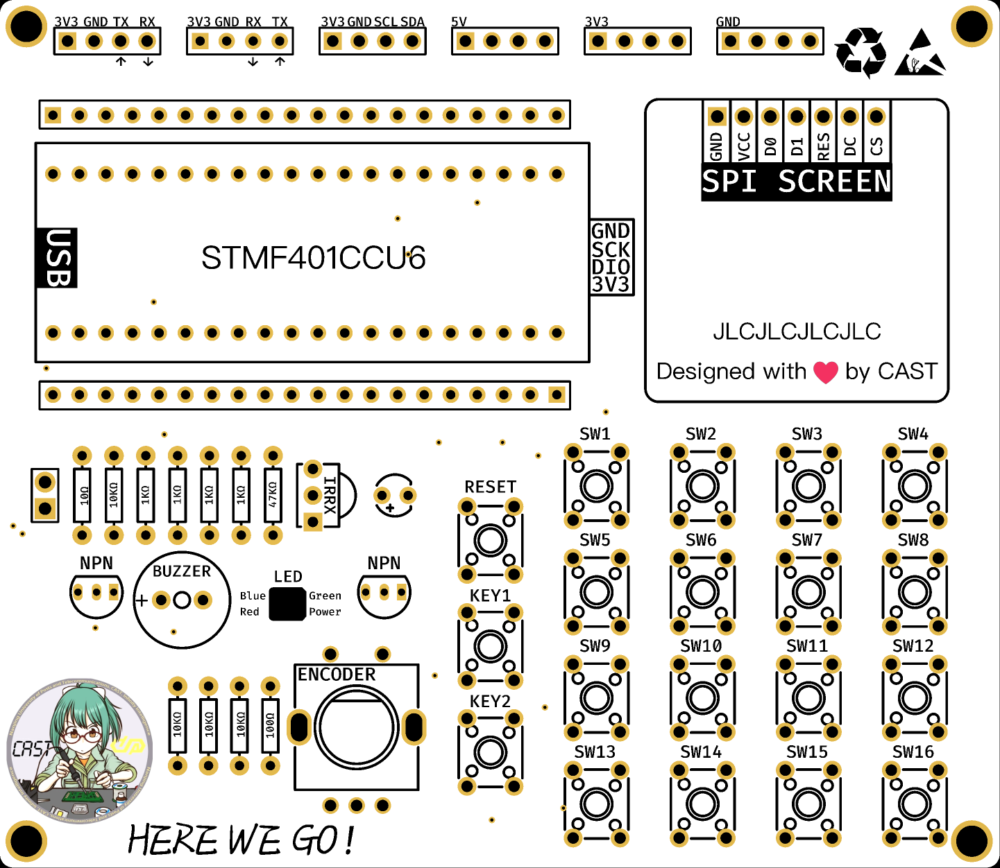
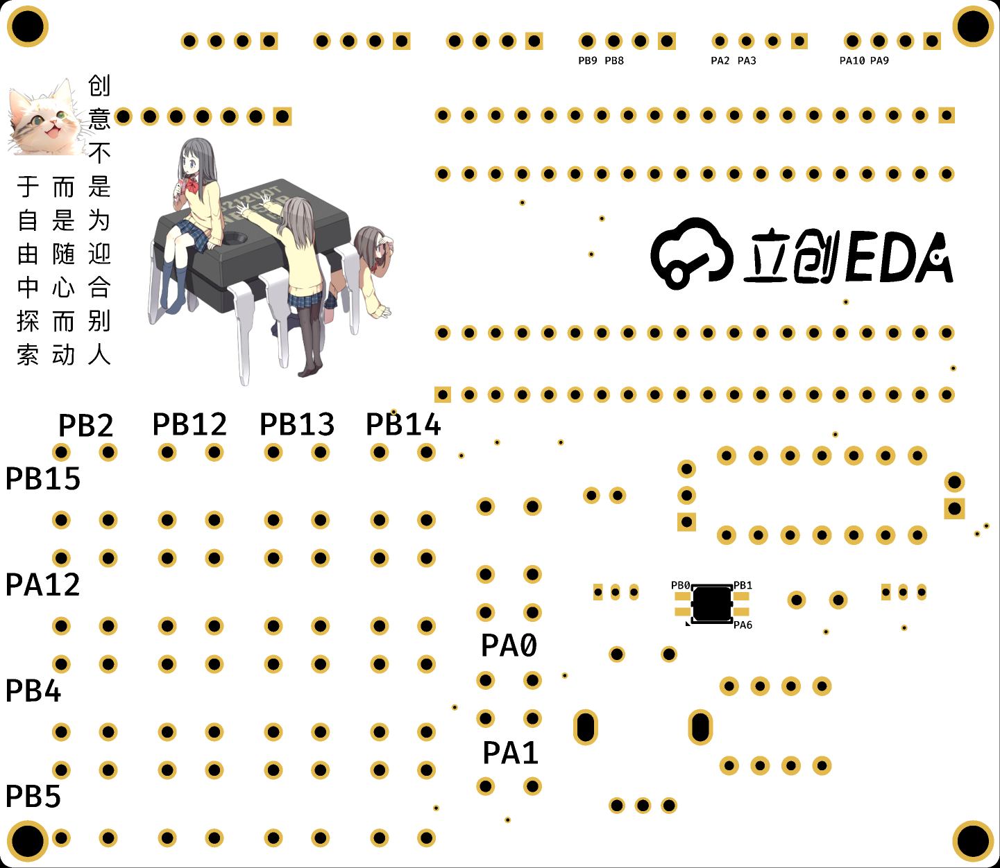
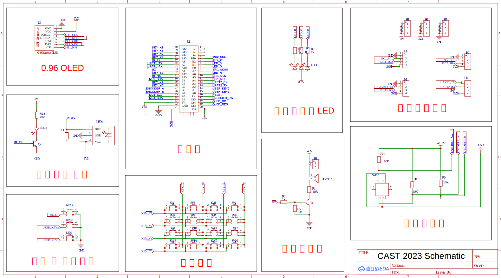

# CAST Edu Board 2023
Choose your language: 
- [English](./README.md)
- [简体中文](./README-zh.md)

## 简介
CAST Edu Board 2023 由通院科协（CAST）专为内部教育用途设计。演示程序使用 C++ 开发，使用 HAL 库驱动，位于 `mcu/` 目录中。

注意：虽然演示程序和电路原理图是开源的，可以在此仓库中找到，但**PCB设计不是开源的**。

在符合许可证要求的前提下，您可以将本项目用于任何用途。

## 硬件

### 预览
  


### 原理图


### 特性
- 所有引脚都已连接至排座
- 128x64 OLED 单色显示器
- 红外传输器和接收器
- 4x4 矩阵键盘
- 2 个独立按键
- 旋转编码器
- RGB LED灯
- 蜂鸣器

## 演示程序

### 版权
```
Copyright (C) 2023 ArcticLampyrid <alampy.com>
This program is free software: you can redistribute it and/or modify
it under the terms of the GNU Affero General Public License as
published by the Free Software Foundation, either version 3 of the
License, or (at your option) any later version.

This program is distributed in the hope that it will be useful,
but WITHOUT ANY WARRANTY; without even the implied warranty of
MERCHANTABILITY or FITNESS FOR A PARTICULAR PURPOSE.  See the
GNU Affero General Public License for more details.

You should have received a copy of the GNU Affero General Public License
along with this program.  If not, see <https://www.gnu.org/licenses/>.
```

### 特性
- 带动画设计的用户界面。
- 使用蜂鸣器播放音调。
- 带呼吸效果的 RGB LED 灯。
- 键盘功能测试模块。
- 红外传输器和接收器测试模块。
- 一个趣味游戏：贪吃蛇。

### 编译 & 烧写
1. 安装 ARM Embedded GCC 工具链 (`arm-none-eabi-gcc`) 和 CMake。
2. 安装 OpenOCD。
3. 配置环境变量：
   ```bash
   export PATH=$PATH:/path/to/gcc-arm-none-eabi/bin
   export PATH=$PATH:/path/to/openocd/bin
   ```
4. 使用 CMake 编译：
   ```bash
   cd mcu
   cmake -S . -B build -DCMAKE_BUILD_TYPE=Release
   cmake --build build --config Release
   ```
5. 使用 OpenOCD 烧写：
   ```bash
   cd mcu
   openocd -f interface/cmsis-dap.cfg -f target/stm32f4x.cfg -c "init" -c "halt" -c "stm32f4x unlock 0" -c "reset halt" -c "flash write_image erase build/cast_edu_board_2023.elf" -c "reset" -c "shutdown"
   ```
   注意：`interface/cmsis-dap.cfg` 表示 CMSIS-DAP 烧录器。如有需要，请用您特定的接口配置替换。

### 开发
推荐使用 [CLion](https://www.jetbrains.com/clion/) 打开本项目。

## 许可证
本项目根据AGPL-3.0或更高版本的许可证授权。请参阅 [LICENSE](LICENSE.md) 文件以获取详尽的信息。

一般来说，您可以出于任何目的使用本项目，包括商业用途。然而，您有义务使您的项目继续开源并保留许可证。您的所有用户都应能访问您项目的源代码。

虽然允许销售这些源代码，但您必须向用户提供许可证和完整的源代码，且不附加任何限制。

此外，“CAST”名称的使用仅限于通院科协（CAST）。如果您打算使用此项目，您需要修改项目名称。并且，你应该删除“CAST”项目名称，但您仍必须保留作者名单。

**（注意：这不是法律建议。应以 [LICENSE](LICENSE.md) 文件为准。）**

## 作者
- 固件开发：[ArcticLampyrid](https://alampy.com/)
- 固件测试：[ArcticLampyrid](https://alampy.com/), Shujian Yu
- 硬件设计：Cancer⭐Bocchi, Fei Zhao, Qiuyang Xu