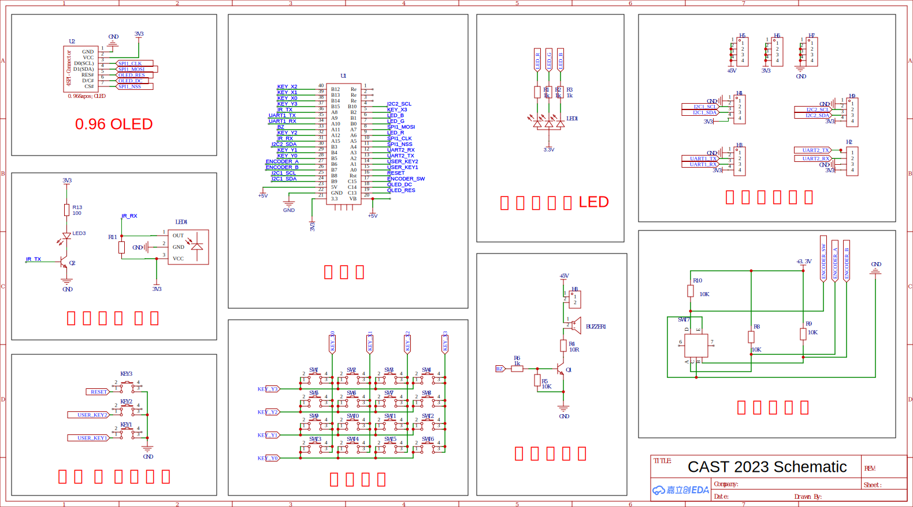

# CAST Edu Board 2023
Choose your language: 
- [English](./README.md)
- [简体中文](./README-zh.md)

## Introduction
The CAST Education Board 2023 is designed for educational purposes by the Communication's Association for Science and Technology (CAST). The demo program is developed in C++ utilizing HAL Drivers and is located in the `mcu/` directory.

While the demo program and schematic are open source and accessible in this repository, please note that **the PCB design is not open source**.

You may use it for any purpose, provided that the licence requirements are met.

## Hardware
### Preview
  
  

### Schematic


### Features
- All pins are routed to headers.
- 128x64 OLED Monochrome Display.
- IR Transmitter & Receiver.
- 4x4 Matrix Keyboard.
- 2 Independent Keys.
- Rotary Encoder.
- RGB LED.
- Buzzer.

## Demo Program

### Copyright
```
Copyright (C) 2023 ArcticLampyrid <alampy.com>
This program is free software: you can redistribute it and/or modify
it under the terms of the GNU Affero General Public License as
published by the Free Software Foundation, either version 3 of the
License, or (at your option) any later version.

This program is distributed in the hope that it will be useful,
but WITHOUT ANY WARRANTY; without even the implied warranty of
MERCHANTABILITY or FITNESS FOR A PARTICULAR PURPOSE.  See the
GNU Affero General Public License for more details.

You should have received a copy of the GNU Affero General Public License
along with this program.  If not, see <https://www.gnu.org/licenses/>.
```

### Features
- Animated UI.
- Tones generated by the buzzer.
- RGB LED with a breathing effect.
- Keyboard functionality tests.
- IR Transmitter & Receiver tests.
- A fun game: Snake.

### Compile & Flash
1. Install the ARM Embedded GCC Toolchain (`arm-none-eabi-gcc`) and CMake.
2. Install OpenOCD.
3. Configure environment variables:
   ```bash
   export PATH=$PATH:/path/to/gcc-arm-none-eabi/bin
   export PATH=$PATH:/path/to/openocd/bin
   ```
4. Compile using CMake:
   ```bash
   cd mcu
   cmake -S . -B build -DCMAKE_BUILD_TYPE=Release
   cmake --build build --config Release
   ```
5. Flash with OpenOCD:
   ```bash
   cd mcu
   openocd -f interface/cmsis-dap.cfg -f target/stm32f4x.cfg -c "init" -c "halt" -c "stm32f4x unlock 0" -c "reset halt" -c "flash write_image erase build/cast_edu_board_2023.elf" -c "reset" -c "shutdown"
   ```
   Note: Replace `interface/cmsis-dap.cfg` with your specific interface configuration if needed.

### Development
It's recommand to open this project with [CLion](https://www.jetbrains.com/clion/).

## License
This project is licensed under the AGPL-3.0 or later License. Refer to the [LICENSE](LICENSE.md) file for comprehensive details.

In essence, you're permitted to utilize this project for any purpose, including commercial use. However, you're obligated to make your project open source and retain the license. All users should have access to your project's source code. 

While selling these source codes is permissible, the LICENSE and the entire source code must be provided to users without added restrictions.

Note that the usage of the name "CAST" is exclusive to the Communication's Association for Science and Technology (CAST). If you intend to repurpose this project, you're required to modify the project name. Although you can exclude the name "CAST", you must still acknowledge the list of authors.

**\(ATTENTION: THIS IS NOT LEGAL ADVICE. THE LICENSE FILE SHOULD PREVAIL.\)**

## Authors
- Fireware Development: [ArcticLampyrid](https://alampy.com/)
- Fireware Test: [ArcticLampyrid](https://alampy.com/), Shujian Yu
- Hardware Design: Cancer⭐Bocchi, Fei Zhao, Qiuyang Xu